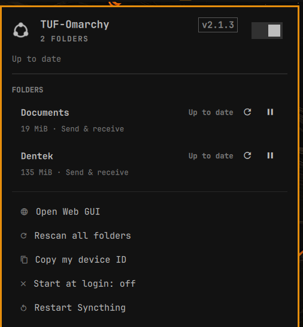
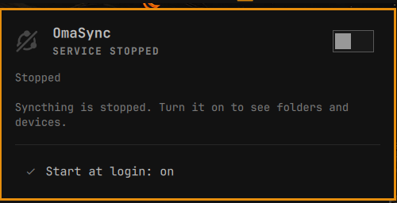

# OmaSyncthing

A native [Omarchy](https://omarchy.org/) bar widget for
[Syncthing](https://syncthing.net/). Folder and device status at a glance, live
transfer rates, incoming share invites — and full control of the `syncthing`
user service without ever leaving the bar, or seeing a password prompt.



## Why

The Syncthing Web GUI is a browser tab you have to remember to open.
OmaSyncthing puts the parts you actually check — is it running, is everything
in sync, who is connected, is anything waiting on me — into the bar, and gives
you the handful of controls worth having a shortcut for.

It also starts and stops the daemon, which the Web GUI cannot do.

## Features

**Service control**

- Start and stop `syncthing.service` from the switch in the panel header, or by
  right-clicking the bar icon
- Restart the service, or restart Syncthing itself
- Toggle start-at-login, which changes only what happens at the *next* login
  and never disturbs a daemon that is currently running
- Everything goes through `systemctl --user`. No `sudo` or `pkexec` is
  required, and no polkit prompt is ever raised

**Folders**

- Every folder with its label, state, size, type and a live progress bar
- Rescan one folder or all of them
- Pause and resume individual folders
- Revert local changes on a receive-only folder that has diverged
- Click a folder to open it in your file manager

**Devices**

- Every remote device, connected first, with a connection pip, address,
  transport and per-device completion
- Pause and resume a device
- Copy a device ID to the clipboard

**Invites**

- Incoming device invites can be accepted or dismissed in place
- Folders another device has offered to share can be accepted — creating the
  folder under `~/Sync/<label>` — or dismissed. The offered label is chosen by
  the remote device, so it is reduced to a single plain directory name: an
  accepted share can only ever land directly inside `~/Sync`

**Everything else**

- Syncthing's own error list, with a clear button
- Copy this machine's device ID; open the Web GUI
- Optional desktop notifications for devices connecting and disconnecting,
  folders finishing or failing, and new invites
- Optional bar label showing transfer rate, overall completion, or connected
  device count

## In the bar


The Syncthing mark is drawn natively rather than loaded from an SVG, so it
takes your theme's foreground colour exactly, stays crisp at bar size, spins
while a sync is running, and picks up a badge when something is waiting for
you. When the service is stopped it is struck through:



## Requirements

- `syncthing` — `omarchy pkg add syncthing`
- `/usr/bin/python3` — part of a base Arch install
- `wl-clipboard` for the copy actions, `xdg-open` for opening folders and the
  Web GUI

Syncthing does not need to be running, configured, or ever started: the panel
renders a sensible first-run state, and the header switch will start it.

## Install

```bash
omarchy plugin add https://github.com/ninepointlabs/omasync --enable
```

Or from a clone:

```bash
git clone https://github.com/ninepointlabs/omasync \
  ~/.config/omarchy/plugins/ninepointlabs.omasync
omarchy plugin enable ninepointlabs.omasync --section right
```

## Remove

```bash
omarchy plugin remove ninepointlabs.omasync
```

That disables the widget in the bar and removes the plugin folder — deleted
outright when it is a git clone, moved to a timestamped backup beside it
otherwise. OmaSyncthing keeps no state of its own beyond the widget's entry in
`~/.config/omarchy/shell.json`, and it never touches Syncthing's own
configuration: the daemon, its config and your synced folders are left exactly
as they were. To remove Syncthing too:

```bash
systemctl --user disable --now syncthing.service
omarchy pkg remove syncthing
```

## Mouse

| Action | Result |
|--------|--------|
| Left click the bar icon | Open the panel |
| Right click the bar icon | Start or stop the Syncthing service |
| Middle click the bar icon | Rescan all folders |
| Click a folder row | Open that folder in your file manager |

## Keyboard

Inside the panel:

| Key | Action |
|-----|--------|
| `j` / `k`, arrows | Move the cursor |
| `enter` / `space` | Activate the current row |
| `t` | Start or stop the Syncthing service |
| `r` | Rescan the selected folder, or all folders |
| `p` | Pause or resume the selected folder or device |
| `o` | Open the selected folder |
| `v` | Revert local changes in the selected receive-only folder |
| `c` | Copy the selected device's ID, the selected folder's path, or this machine's ID |
| `g` | Open the Web GUI |
| `x` | Clear Syncthing's error list |
| `tab` | Move to the next bar panel |
| `esc` | Close |

## Settings

Set these on the widget's entry in `~/.config/omarchy/shell.json`, or through
the bar's widget settings:

| Key | Default | Meaning |
|-----|---------|---------|
| `refreshIntervalSec` | `10` | Backstop poll interval. Syncthing's event stream already pushes changes as they happen, so this only matters while the stream is down. |
| `notify` | `true` | Desktop notifications for connections, completions, failures and invites. |
| `barLabel` | `"none"` | `none`, `rate`, `percent`, or `devices`. Always hidden on a vertical bar. |

## IPC

```bash
omarchy-shell ninepointlabs.omasync open
omarchy-shell ninepointlabs.omasync toggle
omarchy-shell ninepointlabs.omasync start
omarchy-shell ninepointlabs.omasync stop
omarchy-shell ninepointlabs.omasync restart
omarchy-shell ninepointlabs.omasync rescan
omarchy-shell ninepointlabs.omasync status      # "Up to date", "Syncing 2 folders", …
omarchy-shell ninepointlabs.omasync deviceId
```

## How it works

`bin/omasync-bridge` is the only program the plugin starts. It finds the local
Syncthing config, reads the API key out of the `<gui>` block, and does all the
REST and `systemctl` work. Every subcommand prints one JSON object and exits 0,
so a failure arrives as data the panel can render rather than as an exception
in a signal handler. It is invoked by absolute path under
`/usr/bin/python3 -I -S`, never through a `PATH` lookup, so a `mise` or `conda`
Python on `PATH` cannot end up handling your API key.

The panel stays current through Syncthing's own `/rest/events` long-poll rather
than by polling hard: the bridge blocks until the daemon has something to say,
and the panel then re-reads a full snapshot. Applying a snapshot is cheap and
far easier to reason about than replaying event deltas by hand.

The bar instantiates a widget per monitor, so the plugin also declares the
`service` kind. The shell mounts that service once and shares it across
screens, which keeps a multi-monitor setup from polling — and notifying — once
per display.

Transfer rates are computed from successive samples of Syncthing's cumulative
byte counters, the same way its own Web GUI does it, because the API reports no
rate of its own.

## Development

```bash
./tests/run
```

That runs the Omarchy manifest validator, the bridge's Python tests, the
model's node tests, and a QML syntax check.

`Model.js` holds all the presentation logic as plain functions over plain data,
so it can be exercised from node without a running shell.

Saving a `.qml` file under `~/.config/omarchy/plugins/ninepointlabs.omasync`
hot-reloads it. `Model.js` is different: the QML engine caches imported
JavaScript, so a change there needs `omarchy restart shell` — neither saving
the file nor `omarchy-shell shell rescanPlugins` is enough, and the panel will
keep rendering the old logic against new data until you restart.

## Security

- The only program the plugin runs is `bin/omasync-bridge`, invoked by absolute
  path under `/usr/bin/python3 -I -S`. Everything it starts (`systemctl`,
  `xdg-open`, `wl-copy`, `omarchy-notification-send`) is spawned as an argument
  vector, never through a shell.
- No `sudo`, no `pkexec`, no sudoers policy, no privileged helper. The service
  controls use the per-user systemd manager only.
- The Syncthing API key is read from your local `config.xml`, sent only as an
  `X-API-Key` header to the loopback address, and never written to the panel's
  state, a log, or a notification. A wildcard GUI bind is still dialled on
  `127.0.0.1`.
- Nothing is downloaded or executed from the network, and the plugin ships no
  binaries.
- Data that arrives from a remote Syncthing device — device names, folder
  labels — is treated as untrusted: it is rendered as plain text, kept out of
  option position in the notification command, and reduced to a safe single
  directory name before it can influence a path on disk.

To report a problem privately, open a [security
advisory](https://github.com/ninepointlabs/omasync/security/advisories/new).

## License

MIT — see [LICENSE](LICENSE).
